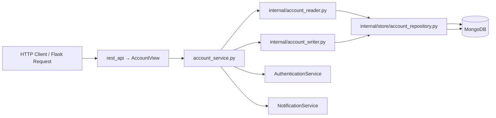

# Backend Architecture

> A **module** is a self-contained package of related functionality in our backend codebase. It encapsulates one domain concept (e.g., accounts, orders, payments) and exposes a clear interface for other parts of the system.

This document covers:

1. **Why** we structure code into modules and the benefits of our layout.
2. **What** each folder and file in a module does.
3. A **diagram** that shows how the layers interact at runtime.

Video explanation: [Backend Architecture Overview](https://www.loom.com/share/e51d50cd8bec4851a2a8718bdc6e34d5)

---

## 1. Why Modular Architecture?

- **Separation of Concerns**: Clearly divides HTTP routing, business logic, data access, and utilities into distinct layers.
- **Reusability**: Public-facing APIs (`account_service.py`, `types.py`) allow other modules to integrate without knowing internal details.
- **Testability**: Small, focused components (reader, writer, util) can be unit‑tested in isolation.
- **Consistency**: Applying the same pattern across modules speeds up onboarding and reduces cognitive load.
- **Scalability**: New features or entirely new domains can be added by copying the template and filling in domain specifics.

---

## 2. Concept & Layers Diagram


```mermaid
flowchart LR
  HTTP[HTTP Client / Flask Request]
  API[rest_api → AccountView]
  Service[account_service.py]
  Reader[internal/account_reader.py] & Writer[internal/account_writer.py]
  Repo[internal/store/account_repository.py]
  MongoDB[(MongoDB)]

  HTTP --> API --> Service --> Reader --> Repo --> MongoDB
  Service --> Writer --> Repo --> MongoDB
  Service --> AuthenticationService
  Service --> NotificationService
```

1. **HTTP Layer** (`rest_api/`): Routing and request/response handling.
2. **Service Layer**: Business logic, orchestration, calls to external services.
3. **Persistence Layer**: Reader/Writer + Repository + Model (MongoDB).
4. **Utilities & Types**: Shared helpers (utils) and data models (DTOs).

---

## 3. Typical Module Folder Structure

```
<module_name>/
├── <module_name>_service.py   # Public API for other modules
├── internal/                  # Implementation details (not imported externally)
│   ├── store/                 # DB model & repository
│   │   ├── *_model.py
│   │   └── *_repository.py
│   ├── *_reader.py            # Read operations
│   ├── *_writer.py            # Write operations
│   └── *_util.py              # Conversion, validation, common helpers
├── rest_api/                  # HTTP routes & handlers
│   ├── *_rest_api_server.py
│   ├── *_router.py
│   └── *_view.py
├── types.py                   # Data Transfer Objects (DTOs)
└── errors.py                  # Module-specific exception classes
```

> **Note**: Replace `<module_name>` and `*` with your module’s actual name.

---

## 4. Module Layout

> We will refer to the **account** module throughout this document to demonstrate each concept.

```
account/
├── account_service.py
├── internal/
│   ├── store/
│   │   ├── account_model.py
│   │   └── account_repository.py
│   ├── account_reader.py
│   ├── account_writer.py
│   └── account_util.py
├── rest_api/
│   ├── account_rest_api_server.py
│   ├── account_router.py
│   └── account_view.py
├── types.py
└── errors.py
```

### 4.1 `account_service.py`

- **Role**
  - Exposes module‐wide operations as static methods, e.g. `create_account_by_username_and_password`, `reset_account_password`, `get_account_by_id`, `update_account_profile`, plus wiring into **AuthenticationService** (for OTP/password) and **NotificationService** (for preferences).
- **Imports**
  ```python
  from modules.account.internal.account_reader import AccountReader
  from modules.account.internal.account_writer import AccountWriter
  from modules.account.types import (
      Account,
      CreateAccountByUsernameAndPasswordParams,
      ResetPasswordParams,
      UpdateAccountProfileParams,
      ...
  )
  from modules.authentication.authentication_service import AuthenticationService
  from modules.notification.notification_service import NotificationService
  ```
- **Example call**
  ```python
  AccountService.create_account_by_username_and_password(
      params=CreateAccountByUsernameAndPasswordParams(username="alice", password="secret")
  )
  ```

---

## 5. Persistence Layer (`internal/store/`)

### 5.1 `account_model.py`

- A `@dataclass` extending `BaseModel`
- Defines all Mongo fields (e.g. `first_name`, `hashed_password`, `phone_number`, `username`, `active`, `created_at`, `updated_at`)
- `@staticmethod from_bson()` to validate & hydrate a model from raw BSON
- `@staticmethod get_collection_name()` returns `"accounts"`

### 5.2 `account_repository.py`

- `class AccountRepository(ApplicationRepository[Account, AccountQuery])`
- A repository is **pure storage**. It **inherits** the generic CRUD surface from `ApplicationRepository`
  and only declares what is specific to this collection:
  - `collection_name` — the Mongo collection name
  - `on_init_collection()` — sets up JSON-Schema validation (via `create_collection`) and any indexes
  - `from_doc(doc) -> Account` — hydrates a stored document into the `Account` domain dataclass (required)
  - `to_doc(entity) -> StoredDocument` — serializes an `Account` into a document; override only when the
    default (which uses `to_bson()` / a dataclass) is not enough — e.g. when a separate `*Model` supplies
    stored-only fields like `active`/timestamps
  - `_to_filter(params) -> StoreFilter` — maps the module's typed `AccountQuery` to a store filter (only
    if the repository supports `query()`)

#### The generic `ApplicationRepository[Entity, Query]`

`ApplicationRepository` (in `modules/application/repository.py`) is generic over the entity it stores **and**
the typed query object it accepts. It owns the shape of "talk to the database" once, so a concrete
repository is mostly declaration:

```python
@dataclass(frozen=True)
class AccountQuery(QueryParams):
    id: Optional[str] = None
    username: Optional[str] = None
    phone_number: Optional[PhoneNumber] = None
    active: Optional[bool] = True  # accounts are soft-deleted; reads default to active records

class AccountRepository(ApplicationRepository[Account, AccountQuery]):
    collection_name = "accounts"

    @classmethod
    def from_doc(cls, doc: StoredDocument) -> Account:
        model = AccountModel.from_bson(doc)
        return Account(id=str(model.id), username=model.username, ...)

    @classmethod
    def _to_filter(cls, params: AccountQuery) -> StoreFilter:
        f: StoreFilter = {}
        if params.username is not None:
            f["username"] = params.username
        if params.active is not None:
            f["active"] = params.active
        return f
```

The public surface is the CRUD verbs, each speaking the domain (ids, entities, typed query objects) and
returning domain entities — never raw BSON:

| Verb                                  | Input                       | Returns               |
| ------------------------------------- | --------------------------- | --------------------- |
| `create(entity)`                      | a domain entity             | the stored entity     |
| `find(id)`                            | a primary id                | the entity or `None`  |
| `find_many(ids)`                      | several primary ids         | a list of entities    |
| `query(params)`                       | a typed query object        | a list of entities    |
| `query_one(params)`                   | a typed query object        | the entity or `None`  |
| `query_paginated(params, pagination)` | a typed query + page params | a `PaginationResult`  |
| `count(params)`                       | a typed query object        | the number of matches |
| `update(id, fields)`                  | id + fields to patch        | the refreshed entity  |
| `update_fields(id, fields)`           | id + fields to patch        | `True` if it matched  |
| `delete(id)`                          | a primary id                | `True` if it existed  |

`query_paginated` is the one place pagination math (count + skip + limit + total pages) lives, so no
repository re-derives it. `update` reads the row back and returns the refreshed entity; `update_fields` is
the same `$set` without the read-back (returns only whether a row matched), for writers that patch and
discard the result, so they pay one round-trip instead of two. A malformed id is treated as "no such
document" (the verb returns `None`/`False`), not an error — so a path param can be passed straight through.

**No MongoDB crosses the public surface.** Callers never write a `{"field": ...}` filter, an `ObjectId`,
or a `$set`. A field-combination read is a typed object — `query(AccountQuery(username=x))`, the analogue
of `/accounts?username=x` — and `_to_filter` is the single place where domain fields become store syntax.
The `ObjectId`/`$set`/`count_documents` specifics live inside the base, in each repository's
`from_doc`/`to_doc`, and in `_to_filter`. Replacing MongoDB with another store is a change to those hooks,
not to any consumer.

The only deliberately untyped values in the layer are the storage-boundary aliases declared in the base —
`StoredDocument`, `StoreFilter`, `FieldUpdates`, `SortSpec` — which name the genuinely heterogeneous maps
at the database edge so the `dict[str, Any]` blur is confined there and visible.

> The generic base uses Python 3.12 type-parameter syntax (`class ApplicationRepository[Entity, Query]:`,
> `type StoredDocument = ...`). The backend runs and is checked on Python 3.12.

**A repository is pure storage; domain reads/writes live on the reader/writer.** A thin domain method —
"find the account with this username", "expire previous OTPs", "mark this token used" — is NOT a repository
method; it lives on the module's reader (reads) or writer (writes), which calls the verbs:
`AccountReader.get_account_by_username` is `AccountRepository.query_one(AccountQuery(username=...))`. This
keeps the layer you would rewrite for a new store down to the genuinely store-specific code.

What genuinely stays on the repository (no CRUD verb expresses it, so a store swap rewrites it): an upsert
or update by a natural key (`AccountNotificationPreferencesRepository.update_by_account_id`), a create that
keys store-shaped fields the domain entity does not carry (`PasswordResetTokenRepository.create_for_account`
keys `account` as an `ObjectId` and `expires_at` as a date), an atomic `$inc`/`$push`, an aggregation, a
`distinct`. Each is a named method the writer/reader calls, so callers stay storage-agnostic even though
the method itself is not. A query-less repository (a singleton store, a write-only log) declares `NoQuery`
as its query type: `ApplicationRepository[Entity, NoQuery]`.

---

## 6. I/O Helpers (`internal/`)

### 6.1 `account_reader.py`

- `class AccountReader:`
  - High-level **read** methods, e.g.
    - `get_account_by_id(params: AccountSearchByIdParams) -> Account`
    - `get_account_by_phone_number(phone_number: PhoneNumber) -> Account`
    - `get_account_by_username_and_password(params: AccountSearchParams) -> Account`
  - Calls the repository verbs with typed query objects, e.g.
    `AccountRepository.query_one(AccountQuery(username=username))` — never a raw filter
  - The repository's `from_doc` already returns a domain `Account`, so the reader does no BSON conversion
  - Raises module-specific exceptions if not found or duplicates

### 6.2 `account_writer.py`

- `class AccountWriter:`
  - High-level **write** methods, e.g.
    - `create_account_by_username_and_password(params: CreateAccountByUsernameAndPasswordParams) -> Account`
    - `update_account_profile(account_id: str, params: UpdateAccountProfileParams) -> Account`
    - `reset_account_password(params: ResetPasswordParams) -> Account`
  - Handles:
    - Phone-number validation via `phonenumbers.parse` & `is_valid_number`
    - Password hashing via `AccountUtil.hash_password()`
    - Persistence via the repository verbs — `AccountRepository.create(account)`,
      `AccountRepository.update(id, fields)` / `update_fields(id, fields)` — never raw `insert_one` / `$set`
    - Not-found errors (`AccountWithIdNotFoundError`)

### 6.3 `account_util.py`

- `class AccountUtil:`
  - `hash_password(password: str) -> str`
  - `compare_password(password: str, hashed_password: str) -> bool`
  - (BSON → domain conversion now lives in `AccountRepository.from_doc`, not here.)

---

## 7. Shared Types & Errors

### 7.1 `types.py`

All of the data transfer objects (DTOs) are `@dataclass`es, for instance:

```python
@dataclass(frozen=True)
class CreateAccountByUsernameAndPasswordParams:
    username: str
    password: str

@dataclass(frozen=True)
class Account:
    id: str
    first_name: str
    last_name: str
    username: str
    phone_number: PhoneNumber
    hashed_password: str
```

Clients import these for type safety.

### 7.2 `errors.py`

Custom `AppError` subclasses, e.g.:

```python
class AccountWithUserNameExistsError(AppError): ...
class AccountWithPhoneNumberNotFoundError(AppError): ...
class AccountNotFoundError(AppError): ...
```

Each carries its own HTTP status code and error code from `AccountErrorCode` in `types.py`.

---

## 8. HTTP Layer (`rest_api/`)

### 8.1 `account_rest_api_server.py`

Bootstraps a Flask `Blueprint`:

```python
def create() -> Blueprint:
    bp = Blueprint("account", __name__)
    return AccountRouter.create_route(blueprint=bp)
```

### 8.2 `account_router.py`

Registers URL rules on the Blueprint:

```python
blueprint.add_url_rule("/accounts", methods=["POST"], view_func=AccountView.as_view("account_view"))
blueprint.add_url_rule(
    "/accounts/<account_id>",
    methods=["DELETE", "GET", "PATCH"],
    view_func=AccountView.as_view("account_view_by_id"),
)
blueprint.add_url_rule(
    "/accounts/<account_id>/notification-preferences",
    methods=["PATCH"],
    view_func=AccountView.update_account_notification_preferences,
)
```

### 8.3 `account_view.py`

`class AccountView(MethodView):`

- Uses `flask.request` to parse JSON
- Marshals params into dataclasses (e.g. `CreateAccountByPhoneNumberParams(**request.json)`)
- Calls `AccountService.*`
- Returns `jsonify(asdict(result)), <status_code>`
- Raises `AccountBadRequestError` for missing/invalid inputs

## 9. Auditing

The audit trail is a SOC2 control, and it is built into the persistence layer so coverage does not depend on any caller remembering to log. It lives inside the `application` module (`modules/application/internals/audit/`), with its shared types in `modules/application/common/types.py`.

### 9.1 Every repository write is audited

`ApplicationRepository.create`, `update`, `update_fields`, and `delete` each record an audit entry automatically. An entry holds:

- `resource_type` (the collection, or a repository's `audit_resource_type`) and `resource_id`
- `actor_type` (`account`, `worker`, or `anonymous`) and `actor_id` — who performed the action; `actor_id` is null for an anonymous actor
- `action` (`create` / `update` / `delete` / `read`)
- `changes` on an update: `{field: {old, new}}`, with sensitive fields (`password`, `token`, `secret`, `otp`, `mfa`, `hashed`) redacted to `[redacted]`
- `timestamp`

Because emission is in the base class, a module gets auditing for free. Views, services, readers, and writers contain no audit code beyond passing the actor through.

### 9.2 The actor is an explicit parameter

Every mutating repository method takes a required `actor: AuditActor` keyword argument (`AuditActor(actor_type, actor_id)`, in `modules/application/common/types.py`). There is no ambient context: the actor is threaded from the boundary down through the service and writer to the repository, so the type checker proves at compile time that no write can happen without one.

There are three actor types, chosen by whether identity is proven at the moment of the write:

- `AuditActor(ActorType.ACCOUNT, account_id)` — a proven identity. The credentials, access token, or reset token in hand actually identify an account. Views build it from the account the auth middleware put on the request; internal flows pass the account resolved from the proven credential. This covers login (OTP verify and access-token creation), password-reset completion (verify + mark-used + the password update), and every authenticated mutation.
- `AuditActor(ActorType.WORKER, worker_name)` — a background job, seed, or system action, named after the worker.
- `AuditActor(ActorType.ANONYMOUS, None)` — a request with no proven identity yet. `actor_id` is null. This covers signup, OTP request/creation (asking for a code by phone, before authenticating), and the forgot-password token request (you have no session because you forgot your password).

Every repository is audited (the `audit_log` store is the sole exception, to avoid recording its own writes). Threading the actor as a required argument is the completeness guarantee: no unattributed write reaches the database.

### 9.3 The rare explicit case

If a custom method performs an access the generic CRUD does not cover, call `ApplicationService.record_audit(resource_type=..., resource_id=..., action=..., changes=...)`. This should be uncommon; frequent use usually means the data access belongs in a repository instead.
