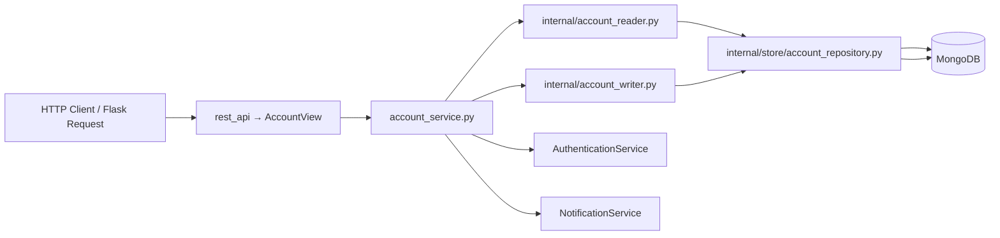

# Backend Architecture

This document describes the conventions and folder structure we follow for all backend modules, illustrated here with the **Account** module.

Video explanation: [Backend Architecture Overview](https://www.loom.com/share/e51d50cd8bec4851a2a8718bdc6e34d5)

---

## 1. Module Layout

```
account/
├── account_service.py
├── internal/
│   ├── store/
│   │   ├── account_model.py
│   │   └── account_repository.py
│   ├── account_reader.py
│   ├── account_writer.py
│   └── account_util.py
├── rest_api/
│   ├── account_rest_api_server.py
│   ├── account_router.py
│   └── account_view.py
├── types.py
└── errors.py
```

### 1.1 `account_service.py`

- **Role**  
  - Exposes module‐wide operations as static methods, e.g. `create_account_by_username_and_password`, `reset_account_password`, `get_account_by_id`, `update_account_profile`, plus wiring into **AuthenticationService** (for OTP/password) and **NotificationService** (for preferences).
- **Imports**  
  ```python
  from modules.account.internal.account_reader import AccountReader
  from modules.account.internal.account_writer import AccountWriter
  from modules.account.types import (
      Account,
      CreateAccountByUsernameAndPasswordParams,
      ResetPasswordParams,
      UpdateAccountProfileParams,
      …
  )
  from modules.authentication.authentication_service import AuthenticationService
  from modules.notification.notification_service import NotificationService
  ```
- **Example call**  
  ```python
  AccountService.create_account_by_username_and_password(
      params=CreateAccountByUsernameAndPasswordParams(username="alice", password="secret")
  )
  ```

---

## 2. Persistence Layer (`internal/store/`)

### 2.1 `account_model.py`

- A `@dataclass` extending `BaseModel`  
- Defines all Mongo fields (e.g. `first_name`, `hashed_password`, `phone_number`, `username`, `active`, `created_at`, `updated_at`)  
- `@staticmethod from_bson()` to validate & hydrate a model from raw BSON  
- `@staticmethod get_collection_name()` returns `"accounts"`

### 2.2 `account_repository.py`

- `class AccountRepository(ApplicationRepository)`  
- Provides:
  - `collection()` — the Mongo `Collection` object
  - `on_init_collection()` — sets up JSON-Schema validation (via `create_collection`) and any indexes  
- Central place for low-level DB concerns

---

## 3. I/O Helpers (`internal/`)

### 3.1 `account_reader.py`

- `class AccountReader:`  
  - High-level **read** methods, e.g.  
    - `get_account_by_id(params: AccountSearchByIdParams) -> Account`  
    - `get_account_by_phone_number(phone_number: PhoneNumber) -> Account`  
    - `get_account_by_username_and_password(params: AccountSearchParams) -> Account`  
  - Uses `AccountRepository.collection().find_one(...)`
  - Converts raw BSON → domain via `AccountUtil.convert_account_bson_to_account()`
  - Raises module-specific exceptions if not found or duplicates

### 3.2 `account_writer.py`

- `class AccountWriter:`  
  - High-level **write** methods, e.g.  
    - `create_account_by_username_and_password(params: CreateAccountByUsernameAndPasswordParams) -> Account`  
    - `create_or_update_account_notification_preferences(...) -> AccountNotificationPreferences`  
    - `update_account_profile(account_id: str, params: UpdateAccountProfileParams) -> Account`  
    - `reset_account_password(params: ResetPasswordParams) -> Account`  
  - Handles:
    - Phone-number validation via `phonenumbers.parse` & `is_valid_number`
    - Password hashing via `AccountUtil.hash_password()`
    - Mongo `insert_one` / `find_one_and_update`
    - Not-found errors (`AccountWithIdNotFoundError`)

### 3.3 `account_util.py`

- `class AccountUtil:`  
  - `hash_password(password: str) -> str`  
  - `compare_password(password: str, hashed_password: str) -> bool`  
  - `convert_account_bson_to_account(bson: dict) -> Account` (uses `AccountModel.from_bson`)

---

## 4. Shared Types & Errors

### 4.1 `types.py`

All of the data transfer objects (DTOs) are `@dataclass`es, for instance:
```python
@dataclass(frozen=True)
class CreateAccountByUsernameAndPasswordParams:
    username: str
    password: str

@dataclass(frozen=True)
class Account:
    id: str
    first_name: str
    last_name: str
    username: str
    phone_number: PhoneNumber
    hashed_password: str
```
Clients import these for type safety.

### 4.2 `errors.py`

Custom `AppError` subclasses, e.g.:
```python
class AccountWithUserNameExistsError(AppError): …
class AccountWithPhoneNumberNotFoundError(AppError): …
class AccountNotFoundError(AppError): …
```
Each carries its own HTTP status code and error code from `AccountErrorCode` in `types.py`.

---

## 5. HTTP Layer (`rest_api/`)

### 5.1 `account_rest_api_server.py`

Bootstraps a Flask `Blueprint`:
```python
def create() -> Blueprint:
    bp = Blueprint("account", __name__)
    return AccountRouter.create_route(blueprint=bp)
```

### 5.2 `account_router.py`

Registers URL rules on the Blueprint:
```python
blueprint.add_url_rule("/accounts", view_func=AccountView.as_view("accounts"))
blueprint.add_url_rule("/accounts/<id>", view_func=AccountView.as_view("accounts_by_id"), methods=["GET", "PATCH"])
blueprint.add_url_rule(
    "/accounts/<account_id>/notification-preferences",
    view_func=AccountView.update_account_notification_preferences,
    methods=["PATCH"],
)
```

### 5.3 `account_view.py`

`class AccountView(MethodView):`
- Uses `flask.request` to parse JSON
- Marshals params into dataclasses (e.g. `CreateAccountByPhoneNumberParams(**request.json)`)
- Calls `AccountService.*`
- Returns `jsonify(asdict(result)), <status_code>`
- Raises `AccountBadRequestError` for missing/invalid inputs

---

## 6. How It All Fits



- **Separation of concerns**  
  - HTTP parsing & routing (Flask)  
  - Service orchestration  
  - Persistence (Reader/Writer + Repository + Model)  
  - Utility (password hashing, BSON conversion)  
  - Shared DTOs & Errors  

You can use this template for any new module—just swap out “account” for your module name and adjust domain types, store schemas, and REST routes as needed.
