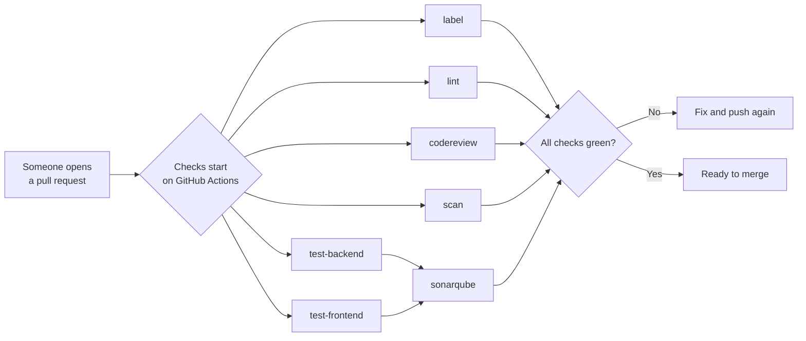

# Continuous Integration

Every change to an application built from this template is checked automatically before it becomes
part of the product. This guide explains what those checks are, why they exist, and what happens
when you propose a change (a pull request).

## Why this exists

Several people work on a project at once, and every edit they make has to be combined into one shared
version of the product. Checking each edit by hand, every time, would be slow and easy to get wrong —
and a small mistake in the wrong place could break a login, drop test coverage, or ship a known
security hole.

Continuous Integration, or **CI**, is the automatic first layer of that checking. Whenever someone
proposes an edit (called a **pull request**), a fixed set of checks runs on it automatically. If any
check fails, it shows up on the pull request for the author to fix before the change moves on.
Passing the checks is not the final step — a teammate still reviews the pull request before it is
merged. What CI gives them is the confidence that the edit already builds, passes its tests, and
meets the project's quality and security bars, so the reviewer spends their attention on the design
and the problem it solves, not on catching broken tests or style slips.

## The tool we use: GitHub Actions

The code lives on GitHub, and the checks run on a built-in part of GitHub called **GitHub Actions**:
automation that lives inside GitHub. It is set up once — the check definitions live in
`.github/workflows/` — and from then on it runs the checks automatically on every pull request, on
GitHub's own servers, with nobody pressing a button. You do not install or run anything yourself.
When you open a pull request, the checks just start.

## How the checks run

When a change is proposed, GitHub Actions starts the checks below. Most of them run at the same time,
independently of each other. The one exception is the code-quality check (`sonarqube`): it reuses the
results of the automated tests, so it waits for `test-backend` and `test-frontend` to finish before
it starts.

Two details worth knowing:

- While a pull request is a **draft** (the kind you open while still working), the checks hold off.
  They start when you mark the pull request **ready for review**.
- When you push a new commit to a pull request, the run for the previous commit is **cancelled**
  automatically — there is no point paying for a run that a newer commit has already superseded.

## Matching the work to the change

Not every change needs every check. Running the full test-and-scan suite — building the app image,
spinning up the database, running both test suites and the security scanners — on a change that only
edits documentation is wasted compute, and compute minutes are the entire cost of CI.

So the first thing CI does is look at **what the pull request touched**. A small `changes` job
classifies the pull request as _documentation-only_ when every changed file is under `docs/` or is a
`*.md` file, and _code_ otherwise. On a documentation-only pull request the heavy checks —
`test-backend`, `test-frontend`, `scan`, `sonarqube`, and `codereview` — are **skipped**. Only the
checks that are actually relevant to prose run: `lint` (which formats and checks the markdown) and
`label`.

A skipped check is not a failed or missing check. Because the workflow still runs and simply declines
those jobs, GitHub records them as _skipped_, which counts as passing — so a documentation-only pull
request is fully mergeable, and no check is quietly dropped as a merge requirement. When the same
pull request later touches code, every check runs in full again.

**For products built from this template.** Applications created from this template deploy a **preview
environment** on each pull request through the shared
[`jalantechnologies/github-ci`](https://github.com/jalantechnologies/github-ci) workflow. A
documentation-only change does not need a preview either. To inherit this behaviour, gate the
deploy/preview job on the same signal — add the `changes` job to your workflow and give the deploy
job `needs: changes` plus `if: needs.changes.outputs.doc_only == 'false'`, exactly as the checks
below do. A docs-only pull request then deploys no preview and frees that slot for changes that need
one.

## The checks

Seven checks can appear on a pull request. Here's what each one does and how to get it green when it
fails.

### `label`: title and labels

Every pull request needs a title written in a set way — `type(scope): summary`, like
`fix(auth): stop the token refresh racing the worker`. This convention is called a _conventional
commit_, and the `type` at the front names the kind of change. The check fails if the title doesn't
follow it — edit the title to match and it re-runs on its own, no push needed. The prefix also sets
the labels that decide the version bump when the change merges:

| Prefix                                              | Use it when the change…             | Labels applied                    |
| --------------------------------------------------- | ----------------------------------- | --------------------------------- |
| `fix:` / `perf:`                                    | fixes a bug / speeds something up   | `type: …` + `semver: patch`       |
| `feat:`                                             | adds new behaviour                  | `type: feat` + `semver: minor`    |
| `feat!:` / `fix!:`                                  | breaks existing behaviour (the `!`) | same, but `semver: major`         |
| `docs:` `style:` `refactor:` `test:` `chore:` `ci:` | changes only internals or docs      | a `type:` label, no `semver:` one |

**Why it matters:** consistent titles keep the history easy to search, and the size label sets how
the version number goes up when the change merges. `label` runs on its own lightweight workflow
(`pr-labeler`) — it only reads the title and sets labels, so it never checks out the repo or installs
anything.

### `lint`

A _linter_ reads the code and flags likely mistakes and untidy style before a person looks at it; a
_formatter_ checks the code is laid out one consistent way. This check runs both, across the backend
(Python) and the frontend (TypeScript), and the documentation:

- **`mypy` / `pylint`** — check the Python types line up and that modules don't import each other in a
  circle.
- **`ESLint`** — flags broken or banned patterns in the TypeScript.
- **`remark`** — checks the docs for broken markdown.
- **`black`, `isort`, `prettier`** — the formatters; they keep Python, TypeScript, and markdown laid
  out consistently.

Because it lints and formats markdown, `lint` runs on documentation-only pull requests too. If it
fails, the log names the file and rule, and `npm run fmt` fixes the formatting ones.

**Why it matters:** everyone's work ends up looking like it came from one team, so reviewers can focus
on what a change does, not how it's formatted.

### `codereview`

An automated AI reviewer reads the change much like an experienced engineer would and comments inline
wherever it sees a real, merge-blocking problem — a correctness bug, a security hole, a performance
cliff, or a break of the rules in `AGENTS.md`. It leaves style to `lint` and `sonarqube`, and a
single finding turns the check red. If it fails, fix each finding (or reply on the comment if you
disagree) and push for a fresh review. One quirk: a pull request that edits `.github/workflows/`
passes automatically, since the reviewer can't safely run against the very workflow files the change
is rewriting.

The review runs on a cost-efficient model through a shared review gateway, and each pull request gets
a single comment with the running cost of its reviews — updated in place on every commit and priced
from the gateway's published rates. It is skipped on documentation-only pull requests, since there is
no code for it to read.

**Why it matters:** every code change gets a careful second read, every time, without waiting for a
person to be free.

### `test-backend`

This check runs the backend's automated tests, which drive the app through its real web API — real
routing, login, and business logic, backed by a real database — then check both the response and what
got stored. Outside services are stubbed; the app's own code runs for real. It also measures
_coverage_ (the share of the code the tests actually exercise) and hands it to `sonarqube`. Run the
suite locally with `docker compose -f docker-compose.test.yml up --exit-code-from app`. If it fails,
the log names either the failing test or that coverage fell below the enforced floor.

**Why it matters:** a change cannot quietly break a feature that already works.

### `test-frontend`

This check runs the frontend's unit tests (Vitest) and measures their coverage, enforcing a minimum
line-coverage floor. If it fails, the log names the failing test or reports that coverage dropped
below the floor — add or fix tests to bring it back.

**Why it matters:** the user-facing part of the app is held to the same "don't break what works" bar
as the backend.

### `sonarqube`

**SonarQube** scores how healthy the code is and flags parts that are too complicated, duplicated, or
poorly tested. It runs after `test-backend` and `test-frontend`, because it reuses their coverage
figures, and it fails if the change falls below the project's quality bar. If it fails, SonarQube's
result on the pull request links to a dashboard showing exactly which check failed and where — fix
the flagged code, or resolve the finding on the dashboard with a note if it's wrong or out of scope.

**Why it matters:** the app stays healthy and easy to keep changing, instead of slowly turning into a
tangle.

### `scan`

This check looks for known security holes across the changed code, the infrastructure definitions,
and the built app image:

- **Trivy** compares the changed files, their outside dependencies, and the built Docker image
  against public lists of known flaws, and flags anything rated high or critical that has a fix
  available.
- **Checkov** checks the Kubernetes manifests under `lib/kube/` for insecure infrastructure settings.

If it fails, Trivy and Checkov post their findings as pull-request comments — upgrade the flagged
dependency, or fix the flagged manifest.

**Why it matters:** a known weakness is caught here, before it can reach anyone running the app.

## Secrets and variables CI needs

These are configured once on the repository; you never handle them.

| Name                   | Type   | Used by      | What it is for                              |
| ---------------------- | ------ | ------------ | ------------------------------------------- |
| `CODE_REVIEW_API_KEY`  | secret | `codereview` | The DigitalOcean key the review runs on     |
| `CODE_REVIEW_BASE_URL` | var    | `codereview` | Address of the shared code-review gateway   |
| `CODE_REVIEW_MODEL`    | var    | `codereview` | Which gateway model the review runs on      |
| `SONAR_TOKEN`          | secret | `sonarqube`  | Signs in to the SonarQube server            |
| `SONAR_HOST_URL`       | var    | `sonarqube`  | The SonarQube server's address              |
| `TRIVY_SCAN_TOKEN`     | secret | `scan`       | Lets the scan post its findings as comments |

If a repository has no `codereview` or `sonarqube` configuration, those checks detect the missing
settings and pass as a no-op rather than blocking the merge.

## Where CI ends

CI gates the merge. Everything after the merge — raising the version number and deploying the
merged result — is described in [Deployment](deployment.md).
