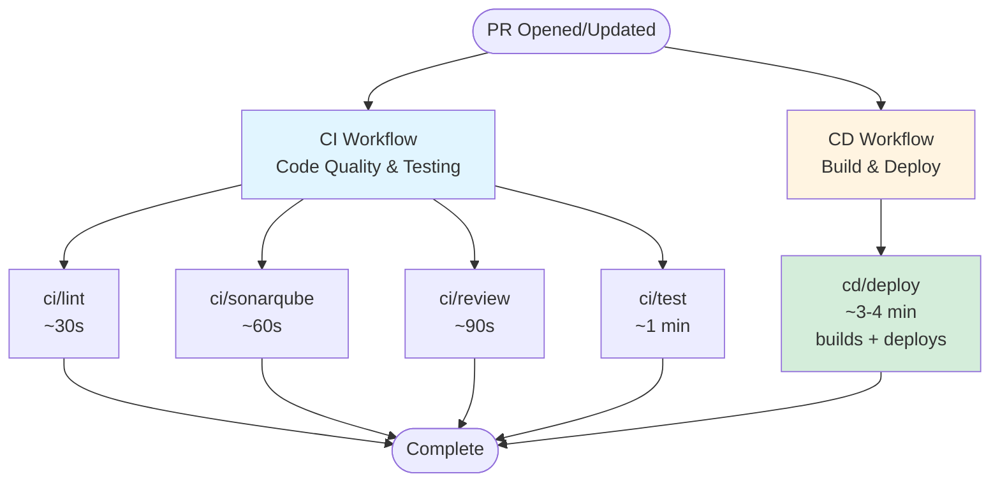

# Deployment Architecture

Flask-React-Template uses a Kubernetes-based deployment strategy for preview and production environments.

---

## Per PR (Preview) Deployment

Each pull request triggers a temporary, isolated environment with:

- **WebApp Pod** – Runs:
  - React frontend
  - Flask backend (Python/Flask API)

- **Worker Pod** – Runs:
  - Celery workers (background job processing)
  - Celery beat scheduler (cron jobs)

- **Redis Pod** – Runs:
  - Redis server (message broker for workers)

This ensures every PR runs independently with full async job processing capabilities.

### Database

- A **MongoDB** database is used for all environments
- A **Redis** instance is deployed per environment for worker job queuing
- All credentials are securely managed via [Doppler](https://www.doppler.com/)

### Environment Configuration

The worker pods require the following environment variables to be set:

- `CELERY_BROKER_URL` - Set automatically in deployment (points to `$KUBE_APP-redis:6379/0`)
- `CELERY_RESULT_BACKEND` - Set automatically in deployment (points to `$KUBE_APP-redis:6379/0`)

These are configured in the deployment YAML files and reference the Redis service deployed alongside the workers. No manual Doppler configuration is required for these variables.

---

## Architecture Diagram

```
                ┌─────────────────────────────┐
                │    GitHub PR (Preview URL)  │
                │   e.g., pr-123.example.com  │
                └─────────────┬───────────────┘
                              │
         ┌────────────────────┴────────────────────┐
         │       Kubernetes Namespace (pr-123)     │
         └────────────────────┬────────────────────┘
                              |
   ┌──────────────────────────┼──────────────────────────┐
   │                  Preview Pods                       │
   │                          │                          │
   │     ┌────────────────────┼────────────────┐         │
   │     │       WebApp Pod   │                │         │
   │     │  - React Frontend  │                │         │
   │     │  - Flask Backend   │                │         │
   │     └────────────────────┘                │         │
   │                                           │         │
   │     ┌────────────────────┐                │         │
   │     │    Worker Pod      │                │         │
   │     │  - Celery Worker   │◄───────────────┤         │
   │     │  - Celery Beat     │   Job Queue    │         │
   │     └────────────────────┘                │         │
   │                                           │         │
   │     ┌────────────────────┐                │         │
   │     │    Redis Pod       │────────────────┘         │
   │     │  - Message Broker  │                          │
   │     └────────────────────┘                          │
   │                                                     │
   └─────────────────────────────────────────────────────┘
```

---

## Worker Scaling

Workers can be scaled independently from the web application, allowing you to handle high async workload without scaling the frontend/backend.

### Preview Environment

```yaml
# Default: 1 worker replica with 8 concurrency
replicas: 1
concurrency: 8
```

### Production Environment

```yaml
# Default: 3 worker replicas with 8 concurrency each
replicas: 3
concurrency: 8
```

### Manual Scaling

Scale workers independently:

```bash
# Scale preview workers
kubectl scale deployment flask-react-template-preview-worker-deployment --replicas=5 -n flask-react-template-preview

# Scale production workers
kubectl scale deployment flask-react-template-production-worker-deployment --replicas=10 -n flask-react-template-production
```

### Resource Allocation

**Preview:**

- Worker: 200m CPU (request), 512Mi memory (request)
- Beat: 50m CPU (request), 128Mi memory (request)
- Redis: 50m CPU (request), 128Mi memory (request)

**Production:**

- Worker: 500m CPU (request), 1Gi memory (request)
- Beat: 50m CPU (request), 128Mi memory (request)
- Redis: 100m CPU (request), 256Mi memory (request)

---

# CI/CD Pipeline

This project uses **GitHub Actions** for continuous integration and deployment on **Kubernetes**, using workflows defined in [github-ci](https://github.com/jalantechnologies/github-ci).

---

## CI/CD Pipeline Structure

When you open or update a pull request, CI and CD workflows run independently:



### CI Workflow (Code Quality & Testing)
All jobs run in parallel and independently:

1. **ci/lint** (~30s) - ESLint and Markdown checks for code style and potential errors
2. **ci/sonarqube** (~60s) - Code quality metrics, complexity, and code smells
3. **ci/review** (~90s) - Automated code review (placeholder for future AI-powered review)
4. **ci/test** (~1 min) - Integration tests using docker-compose

### CD Workflow (Build & Deploy)
Single job that builds Docker image and deploys:

1. **cd/deploy** (~3-4 min) - Builds Docker image and deploys to `{pr-name}.preview.platform.bettrhq.com`

**Note:** All CI checks are advisory and run independently. CD deploys regardless of CI status to enable fast iteration. Code merged to `main` should have passing CI checks from the PR.

---

## Deployment Workflows

### CD Workflows
- **cd** - Deploys preview environment for each PR (`cd/deploy`)
- **cd_production** - Deploys to production when code is merged to `main` (`cd_production/deploy`)
- **cd_permanent_preview** - Updates permanent preview when `main` changes (`cd_permanent_preview/deploy`)

### Cleanup Workflows
- **cleanup_pr** - Automatically removes preview environment when PR is closed

All credentials and secrets are securely managed via GitHub secrets and environment variables. Deployments use github-ci v3.2.5 reusable workflows for Docker image building and Kubernetes deployment.
