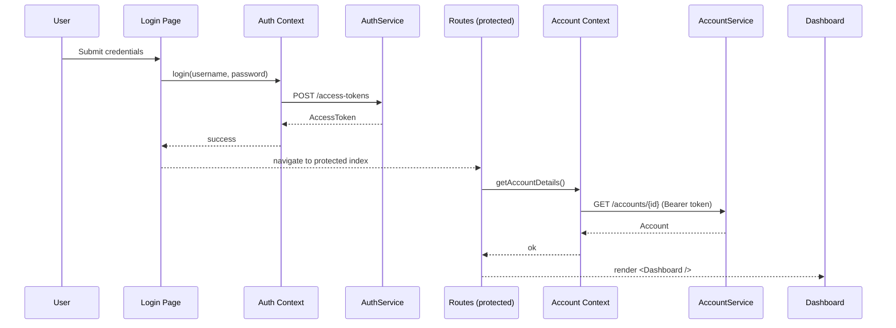

# Frontend Architecture

> A **feature** is the smallest unit of UX value (e.g., Login, Dashboard, Reset Password). Each feature composes **pages** from reusable **components**, orchestrates data via **contexts**, and calls **services** that encapsulate HTTP. **Routes** bind features to URLs. **constants** and **types** are the shared contracts.

---

## 1) Why this architecture?

- **Separation of concerns**: UI rendering (components/pages), state (contexts), data access (services), and navigation (routes) are cleanly separated.  
- **Replaceable boundaries**: APIs/vendors can change with minimal UI rewrites.  
- **Predictability & scale**: Every new feature follows the same recipe: **page + route + service + context + components**.  
- **Testability**: Pages are thin, services are pure wrappers around HTTP, contexts have tiny, mockable APIs.  

---

## 2) High-level runtime flow

```mermaid
flowchart LR
  User[User] --> Page[Page (pages/*)]
  Page --> Cmp[Components (components/*)]
  Page --> Ctx[Contexts (contexts/*)]
  Ctx --> Svc[Services (services/*)]
  Svc --> Net[(HTTP / Vendors)]

  Page --> Router[Routes]
  Router --> Page
```

---

## 3) Repository layout

```
frontend/
  components/       # UI building blocks (button, header, inputs, layouts, flex, etc.)
  pages/            # Screens (login, dashboard, reset-password, otp, about, etc.)
  contexts/         # Global providers (auth, account, reset-password, async)
  services/         # API clients (auth, account, api, app, reset-password)
  routes/           # Router setup + public/protected route logic
  constants/        # Shared constants (routes, messages, endpoints)
  types/            # DTOs & helpers (account, auth, service-response, etc.)
  utils/, helpers/  # Logger, storage-util, config
  vendor/           # Third-party shims (inspectlet)
  index.tsx, app.component.tsx
```

---

## 4) Routing

- **`routes/index.tsx`**:  
  Uses `isUserAuthenticated()` from `auth.provider.tsx`.  
  Builds router with `createBrowserRouter(publicRoutes | protectedRoutes)`.

- **`routes/public.tsx`**:  
  Login, signup, forgot-password, reset-password, otp, about.  

- **`routes/protected.tsx`**:  
  App shell + `getAccountDetails()`.  
  On error → toast → `logout()` → navigate to `/login`.

---

## 5) Services

- **`services/app.service.ts`** → runtime host + axios setup  
- **`services/api.service.ts`** → standard `this.apiClient` with baseURL `/api`  
- **`services/auth.service.ts`**  
  - `login(username, password)` → `POST /access-tokens`  
  - `signup(...)`, `refreshToken()`, OTP flows  
- **`services/account.service.ts`**  
  - `getAccountDetails(token)` → `GET /accounts/{id}`  
- **`services/reset-password.service.ts`**  
  - multi-step reset flow for forgot/reset pages  

---

## 6) Contexts

- **`auth.provider.tsx`**  
  `useAuthContext()` → `{ isUserAuthenticated, login(), logout(), signup(), sendOTP(), verifyOTP() }`  
  Stores tokens via `utils/storage-util.ts`.  

- **`account.provider.tsx`**  
  `useAccountContext()` → `{ accountDetails, isLoading, error, getAccountDetails() }`  
  Auto-fetched on protected routes.  

- **`reset-password.provider.tsx`**  
  State for forgot-password/reset-password flows.  

---

## 7) Pages

- **`pages/login/index.tsx`**  
  - Uses `useAuthContext().login()`.  
  - Delegates form logic to `login-form.hook.ts` (Formik + Yup).  
  - On success: navigate to dashboard.  
  - On error: show toast.  

- **`pages/dashboard/index.tsx`**  
  - Rendered via protected routes.  
  - Assumes `accountDetails` is available from context.  

- **`pages/authentication/*`**  
  - Forgot-password, OTP, reset-password flows.  
  - Each uses a hook + component split for form logic.  

---

## 8) Components

- **Primitives**: `button/`, `input/`, `form-control/`, `flex/`  
- **Layouts**: `layouts/` (`custom-layout`, `horizontal-stack-layout`)  
- **Chrome**: `header/`, `sidebar/`  
- **Feedback**: `toast/`, `dialog/`, `loader/`  
- **Typography**: `typography/h2.tsx`, `paragraph-medium.tsx`

---

## 9) Shared contracts

- **`constants/routes.ts`** → canonical paths  
- **`constants/countries.ts`** → shared dropdown data  
- **`types/service-response.ts`** → standard API wrapper  
- **`types/auth.ts`**, **`types/account.ts`**, **`types/common-types.ts`** → DTOs  

---

## 10) Example end-to-end flow (Login → Dashboard)


